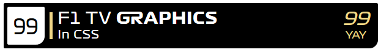
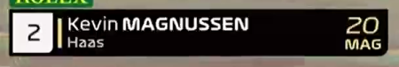
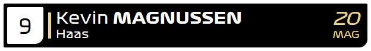
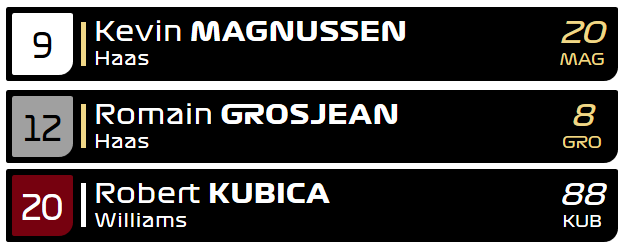

The new 2021 version can be found [here](https://github.com/bodzaital/f1-graphics-css/).

## Usage

Link to the CSS file in the head tag:

```html
<link rel="stylesheet" href="formula1.css">
```

You can either type the HTML out by hand, or use the script `formula1.js` within `dist/`.

### By hand

The format is the following:

```html
<div class="f1 nameplate-short">
    <div class="grid grid-[grid-state]">
        <span>[grid-position]</span>
    </div>
    <div class="separator">
        <div class="color-bg-[team]"></div>
    </div>
    <div class="driver">
        <div class="name">
            <span class="firstname">[first-name]</span><span class="lastname">[last-name]</span>
        </div>
        <div class="constructor">[constructor-name]</div>
    </div>
    <div class="ident">
        <div class="number">[driver-number]</div>
        <div class="abbreviation">[driver-abbreviation]</div>
    </div>
</div>
```

### With script

To create name plates automatically, add the following line just before the closing body tag:

```html
<script src="formula1.js"></script>
```

Then, after you included the script file, call `NewNameplate(json, target)`, which creates and inserts the name plate into the DOM. It takes a JSON object and the parent element's selector to where you want to place it. The JSON object has this context:

```json
{
    "grid": {
        "position": 1,
        "state": "ontrack"
    },
    "color": "williams",
    "firstname": "Robert",
    "lastname": "Kubica",
    "constructor": "Williams",
    "number": 88,
    "abbreviation": "KUB"
}
```


The driver's last name and abbreviation is automatically capitalized by the CSS. 

For `color` and `grid.state`, see below.

## Prerequisites

You need to install the `Formula1 Display` font to your system to render the text correctly.

To create custom colors (see below), you need a Sass compiler.

## Differences

The world feed uses a slightly different font (see: capital `M`). Sizes are not the exact same between the world feed and the CSS. The colors are taken from [this reddit post](https://www.reddit.com/r/formula1/comments/arxt0r/f1_2019_team_colors_hex_codes/). TV compression may render colors and shapes in a different way.

## Comparison

TV broadcast graphics:



Recreated using CSS (from test.html):



## Grid colors

The grid position can be colored to three styles:

- `"grid.state": "ontrack"`: black on white
- `"grid.state": "inpit"`: black on gray
- `"grid.state": "eliminated"`: white on red

These can be used as the following classes:

- `grid grid-ontrack`
- `grid grid-inpit`
- `grid grid-eliminated`



You can add custom grid colors by adding it either `$grid.blacktext` or `$grid.whitetext` lists:

```scss
$grid-blacktext: (
    ("inpit",   rgb(160, 160, 160)),
    ("ontrack", rgb(255, 255, 255)),
    ("dnf",     rgb(255, 255, 0))
);

$grid-whitetext: (
    ("inpit",   rgb(160, 160, 160)),
    ("dns",     rgb(128, 255, 128))
);
```

## Team colors

Team colors are: `.color-[type]-[team]` where:

- `[type]` is

  - `text` for text color, or
  - `bg` for background color

- `[team]` is

  - `mercedes`
  - `ferrari`
  - `redbull`
  - `renault`
  - `haas`
  - `tororosso`
  - `williams`
  - `racingpoint`
  - `alfaromeo`
  - `mclaren`

Example: `<div class="color-bg-mercedes"></div>`

To add or change colors, add a new row to the `_colors.scss` partial's `$teams` variable like this:

```scss
$teams: (
	. . .
	("alfaromeo",   rgb(155,   0,   0)),
	("mclaren",     rgb(255, 135,   0)),
	("my-team",     rgb(135, 135, 135))
);
