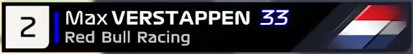

A small CSS file to emulate the 2022 TV graphics of the Formula 1 world feed. The old 2018 version can be found [here](https://github.com/bodzaital/f1-graphics-css/tree/v2018)

## Download and include

Download the [latest release](https://github.com/bodzaital/f1-graphics-css/releases) from the releases tab.

### **1. Link to the CSS file in the head element**

```html
<head>
	...
	<link rel="stylesheet" href="formula1_v2.css">
	...
</head>
```

### **2. Link to the JS file at the bottom of the body element**

```html
<body>
	...
	<script src="formula1_v2.js"></script>
</body>
```

### **3. Generate nameplates**

```html
<div class="container">

</div>
<script src="../dist/formula1_v2.js"></script>
<script>
	// 1. Create a driver object.
	let driver = {
		"grid": {
			"position": 1,
			"state": "ontrack"
		},
		"color": "redbull",
		"firstname": "Max",
		"lastname": "Verstappen",
		"team": "Red Bull",
		"number": 33,
		"abbreviation": "VER",
		"flag": "nl"
	};

	//2. Call create.
	let ver = new Nameplate(driver).Create(document.querySelector(".container"));
	
	// 3. Update position.
	ver.UpdatePosition({"position": 11, "state": "eliminated"});
</script>
```

## Usage

### **1. Create a driver object**

```
grid: {position: number, state: string}
color: string
firstname: string
lastname: string
team: string
number: number
abbreviation: string
flag: string
```

The grid state can be one of `ontrack`, `inpit`, or `eliminated`.

The color must be one of `mercedes`, `ferrari`, `redbull`, `alpine`, `alphatauri`, `haas`, `williams`, `astonmartin`, `alfaromeo`, `mclaren` or another defined color in `_colors.scss`.

The flag must be an ISO 3166 country code defined in https://flagcdn.com/en/codes.json, for example: `nl`.

### **2. Call `new Nameplate(driver).Create(target)`**

`driver` is the driver object.

`target` is the target HTML element where the nameplate will be inserted.

### **3. Update the nameplate position**

Call `Nameplate.UpdateDriver` with the new grid object. The example in test-v2.html increases Verstappen's grid position for every click.

## Prerequisites

The fonts are directly linked from the F1 website.

To create custom colors (see below), you need a Sass compiler.

## Differences

The world feed uses a slightly different font (see: capital `M`). Sizes are not the exact same between the world feed and the CSS. The 2022 team colors are from formula1.com, correct as of 17<sup>th</sup> March 2022. TV compression may render colors and shapes in a different way.

The flags are automatically downloaded from flagcdn.com. The proportions and the visible parts, and effects are different than those on the world feed. For available flags, see https://flagcdn.com/en/codes.json.

## Comparison

TV broadcast graphics:



Recreated using CSS (from test-v2.html):


## Team colors

To add you own team color, edit the `src/_colors.scss` file, and add a new item in the `$teams` variable and recompile, like this:

```scss
$teams: (
	("mercedes",	#6cd3bf),
	("ferrari",		#ed1c24),
	("redbull",		#1e5bc6),
	("alpine",		#2293d1),
	("haas",		#b6babd),
	("alphatauri",	#4e7c9b),
	("williams",	#37bedd),
	("astonmartin",	#2d826d),
	("alfaromeo",	#b12039),
	("mclaren",		#f58020),

	("myteam",      #950245)
);
```

*Colors correct as of 17<sup>th</sup> March 2022.*

## Plans

- The larger and smaller hotlap timing panels
- The timing tower